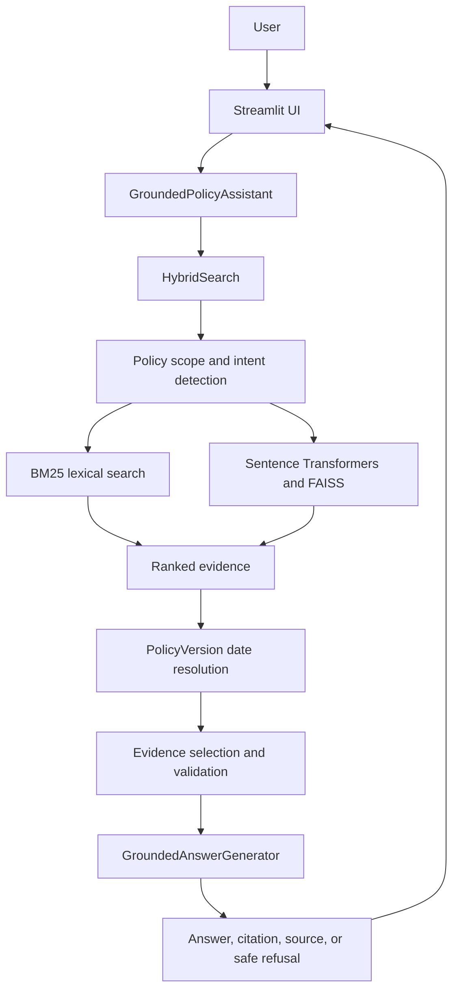
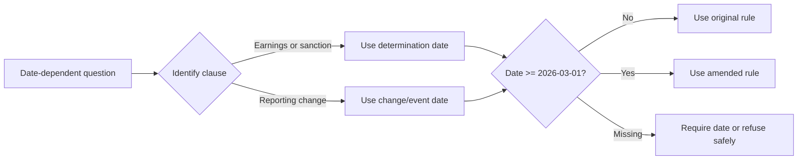

# Project Decision Record

## Grounded Policy Assistant

This document records the major product, engineering, UI, testing, and demonstration decisions made for the Grounded Policy Assistant hackathon project.

## 1. Product Goal

The project is a date-aware policy assistant for the Calder County Household Support Program. The system prioritizes defensible answers supported by official policy evidence over answering every question.

The core principle is:

> If the evidence does not support the answer, the assistant must not guess.

## 2. Source of Truth

The policy corpus is stored in structured JSON files and human-readable source documents.

- `data/clauses.json` contains the consolidated policy clauses used for retrieval.
- `data/amendments.json` contains amendment identifiers, effective dates, affected clauses, and amendment text.
- `Data pack/policy-manual.md` contains the policy manual source.
- `Data pack/Amendment No. 2026-01.md` contains the amendment source.
- `Data pack/DECISIONS.md` contains the original data-pack engineering rationale.

Answers must be based on this corpus. External general knowledge is not used as policy evidence.

## 3. User Interface Decision

Streamlit was selected for the hackathon interface because it provides a fast, demonstrable Python UI around the existing pipeline.

The UI entry point is `app.py`. The project does not use `main.py`.

The interface includes:

- Policy question input.
- Determination date input.
- Change/event date input.
- Submit and clear controls.
- Frequently asked question shortcuts.
- Answerable or unsupported status.
- Answer text.
- Policy version information.
- Supporting clause and citation.
- Expandable answer-generation details.
- Dark mode as the default visual theme.

## 4. Architecture Decision

The application is divided into four logical layers:

1. **Presentation**: Streamlit UI in `app.py`.
2. **Orchestration**: `GroundedPolicyAssistant` in `src/pipeline/assistant.py`.
3. **Retrieval and reasoning**: hybrid retrieval and date-aware policy resolution.
4. **Grounded generation**: evidence validation, answer construction, and citations.



## 5. Hybrid Retrieval Decision

The retrieval engine combines multiple signals:

- BM25 lexical matching for exact policy terms.
- Sentence Transformer embeddings for semantic similarity.
- Keyword overlap.
- Intent-aware section boosts.
- Canonical clause routing for known policy intents.

Semantic retrieval uses the `all-MiniLM-L6-v2` model and FAISS when those dependencies are available. A lexical fallback remains available if the semantic model or FAISS cannot be loaded.

This combination was selected because policy questions often use wording different from the source document while still requiring exact clause identification.

## 6. Policy Scope Decision

The system rejects questions that are clearly outside the Household Support Program domain before attempting to generate an answer.

Examples:

- Weather.
- Programming.
- Sports.
- Movies.
- General facts not contained in the policy corpus.

The expected response is:

```text
I don't know based on the policy manual. Please contact the Calder County Department of Household Services for assistance.
```

## 7. Intent-Aware Retrieval Decision

The system recognizes policy intents and prioritizes the controlling clauses instead of trusting semantic similarity alone.

Supported intent examples:

| Intent | Preferred clause |
| --- | --- |
| Administration | `§1.1.2` |
| General eligibility | `§2.1.2` |
| Vehicle resources | `§2.4.2` |
| Earnings disregard | `§6.4.1` |
| Reporting deadline | `§4.3.2` |
| Correctional exclusion | `§4.1.1` |
| Increased-award sanction protection | `§10.5.3A` |

An explicit clause reference, such as `§2.4.2`, receives priority over general retrieval ranking.

## 8. Grounded Answer Decision

The answer generator does not treat retrieval similarity as proof. It validates that the selected clause text supports the question topic.

The generation process:

1. Rejects empty or missing retrieval responses.
2. Rejects unsupported or out-of-scope questions.
3. Removes incomplete results without clause IDs or text.
4. Selects the most relevant supported clause.
5. Extracts the most relevant sentence or clause text.
6. Returns the exact supporting citation.
7. Returns the safe refusal when evidence is insufficient.

Normal answerable responses include the clause reference and supporting source text.

## 9. Safe Refusal Decision

The assistant must refuse when:

- The question is outside the policy scope.
- Retrieval support is too weak.
- The retrieved text does not support the requested topic.
- A date-dependent clause has no required date.
- The selected evidence is incomplete.

This behavior is intentional and is a core project feature, not an error state.

## 10. Temporal Policy Decision

Policy amendments are not applied universally. The date controlling applicability depends on the clause.

| Clause or rule | Controlling date |
| --- | --- |
| `§6.4.1` earnings disregard | Determination date |
| `§6.6.1` income thresholds | Determination date |
| `§10.5.2` sanctions | Determination date |
| `§10.5.3A` sanction protection | Determination date |
| `§4.3.2` reporting deadline | Change/event date |
| `§9.1.4` overpayment reporting rule | Change/event date |

The effective date of Amendment No. 2026-01 is `2026-03-01`.



## 11. Amendment Application Decision

The amendment is stored independently from the original policy text. `PolicyVersion` resolves whether it applies and then updates known affected text.

Current supported substitutions include:

- `§6.4.1`: `$120` becomes `$175`.
- `§4.3.2`: `10 calendar days` becomes `14 calendar days`.
- `§9.1.4`: `30 calendar days` becomes `14 calendar days`.
- `§10.5.2`: `20 per cent` becomes `15 per cent`.

The final answer includes the resolved policy text, so the citation and displayed evidence correspond to the selected version.

## 12. Transitional Reporting Decision

Reporting deadlines are controlled by the date the change occurred. Therefore:

- Determination date `2026-03-10` with event date `2026-02-28` uses the original 10-day rule.
- Determination date `2026-03-10` with event date `2026-03-01` uses the amended 14-day rule.

This prevents a later determination date from incorrectly changing the rule that applied when the event occurred.

## 13. Conflict Detection Decision

The system explicitly recognizes the question:

```text
Why do the reporting deadlines say 10 and 30 days?
```

It compares:

- `§4.3.2`, which originally stated 10 calendar days.
- `§9.1.4`, which originally stated 30 calendar days.

The answer explains that Amendment No. 2026-01 aligned the requirements to 14 calendar days from `2026-03-01`.

Both clauses are returned as citations. This is preferable to silently selecting one conflicting clause.

## 14. Data Normalization Decision

The source JSON may contain replacement characters where the section symbol should appear because of encoding conversion. Clause normalization therefore converts the Unicode replacement character to the section symbol before matching clause IDs.

This keeps citations consistent for values such as:

```text
§10.5.3A
```

Letter suffixes are preserved, so `§10.5.3A` is not incorrectly reduced to `§10.5.3`.

## 15. Testing Decision

Testing is divided by responsibility:

- Retrieval tests validate scope, ranking, intent routing, and citations.
- Answer-generation tests validate evidence selection and safe refusal.
- Hardening tests validate noisy, duplicate, misleading, and conflicting retrieval results.
- Policy assistant tests validate amendment parsing and temporal resolution.
- Pipeline tests validate end-to-end answers.

Run the tests from the configured virtual environment:

```powershell
cd D:\hackthon\grounded-answer
.\.venv\Scripts\Activate.ps1
python -m pytest -v
```

The acceptance matrix includes:

| Scenario | Expected result |
| --- | --- |
| Program administrator | Answer with `§1.1.2` |
| Eligibility requirements | Answer with `§2.1.2` |
| Car ownership | Answer with `§2.4.2` |
| CEO salary | Safe refusal |
| Reimbursement limit | Safe refusal |
| Earnings on `2026-02-28` | `$120` |
| Earnings on `2026-03-01` | `$175` |
| Reporting event on `2026-02-28` | 10 calendar days |
| Reporting event on `2026-03-01` | 14 calendar days |
| Increased-award missed report | No sanction, `§10.5.3A` |
| Weather | Safe refusal |
| Missing earnings date | Safe refusal or date-required result |
| 10-versus-30-day question | Conflict explanation with two citations |

## 16. Demo Decision

The recommended hackathon demo order is:

1. Show a normal grounded answer: `Who administers the program?`
2. Show intent-aware vehicle evidence: `Can someone owning a car qualify?`
3. Show `$120` before the amendment and `$175` after the amendment.
4. Show 10 versus 14 days using different event dates.
5. Show a safe refusal using `What is the weather today?`
6. Show conflict detection using `Why do the reporting deadlines say 10 and 30 days?`

The demo should emphasize three differentiators:

- Evidence-grounded answers.
- Date-aware policy selection.
- Refusal instead of hallucination.

## 17. Runtime and Environment Decision

The application should be run with the project virtual environment so Streamlit, pytest, FAISS, Sentence Transformers, and the remaining dependencies are available to the same interpreter.

```powershell
cd D:\hackthon\grounded-answer
.\.venv\Scripts\Activate.ps1
python -m streamlit run app.py
```

Open `http://localhost:8501`.

Do not use `python main.py`; that file does not exist in this project.

If port 8501 is unavailable:

```powershell
python -m streamlit run app.py --server.port 8502
```

## 18. Documentation Decision

`README.md` is the evaluator-facing guide. It contains setup instructions, architecture diagrams, component responsibilities, testing instructions, demo steps, troubleshooting, safety notes, and limitations.

This file, `decision.md`, records why those design choices were made and how the final implementation satisfies the project goals.

## 19. Known Limitations

- The assistant can only answer from the included policy corpus.
- It is not legal advice and does not replace official case review.
- Semantic retrieval depends on the model being available.
- The first semantic startup may require internet access to download model files.
- Amendment text application currently supports known structured substitutions rather than arbitrary legislative transformations.
- Conflict handling currently targets the known reporting-deadline conflict.
- Date inputs must be valid and use the expected date format.

## 20. Final Acceptance Checklist

- [x] Streamlit UI entry point is documented.
- [x] Dark mode is the default.
- [x] Date fields are compact and aligned.
- [x] Normal policy answers include citations.
- [x] Unsupported questions receive safe refusals.
- [x] Vehicle resource handling is supported.
- [x] Earnings disregard is date-aware.
- [x] Reporting deadline is event-date-aware.
- [x] Increased-award sanction protection is supported.
- [x] Reporting-date conflict is surfaced with both citations.
- [x] README includes setup and architecture documentation.
- [x] Focused runtime acceptance checks pass.
- [x] Edited Python files report no diagnostics.

## Final Principle

> A useful policy assistant is not the system that answers the most questions. It is the system that gives the most defensible answer, shows its evidence, applies the correct version, and knows when to say it does not know.
