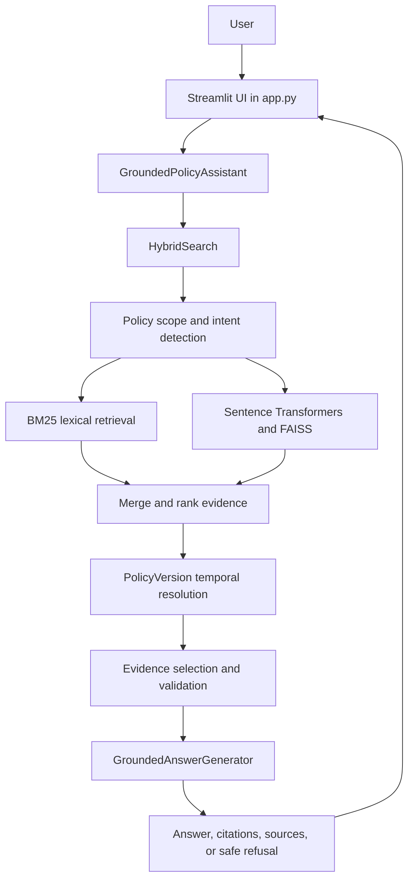
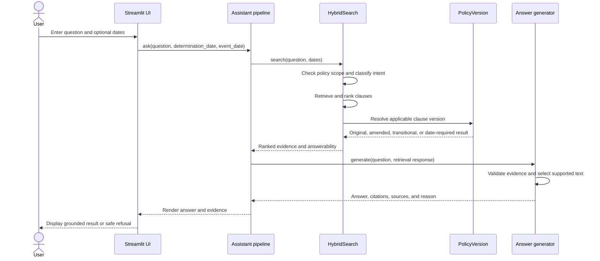
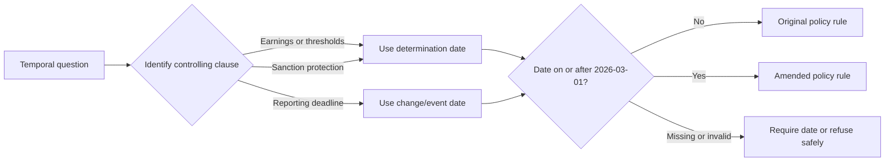

# Grounded Policy Assistant

## Reviewer Quick Start

This section is the complete verification path for an invigilator. Run the commands in order.

### 1. Get the project

```powershell
git clone https://github.com/mbkbala/grounded-answer.git
cd grounded-answer
```

### 2. Create and activate the Python environment

Windows PowerShell:

```powershell
python -m venv .venv
.\.venv\Scripts\Activate.ps1
```

If PowerShell blocks activation, run this once as the current user:

```powershell
Set-ExecutionPolicy -Scope CurrentUser RemoteSigned
```

### 3. Install dependencies

```powershell
python -m pip install --upgrade pip
python -m pip install -r requirements.txt
python -m pip install pytest
```

The first startup may download the `all-MiniLM-L6-v2` semantic model. Internet access is required for that first download. The application can fall back to lexical retrieval if semantic dependencies are unavailable.

### 4. Run the command-line assistant

```powershell
python -m src.pipeline.assistant
```

The CLI should:

1. Load the policy clauses and temporal policy engine.
2. Display `Assistant ready.`
3. Ask `Enter your question:`.
4. Accept `exit` or `quit` to stop.

Try:

```text
Who administers the program?
```

Expected behavior:

```text
Answer: the Calder County Department of Household Services
Citation: section 1.1.2
Answerable: True
```

For temporal questions, the CLI asks for dates in `YYYY-MM-DD` format:

```text
Enter your question: What is the earnings disregard?
Determination date (optional): 2026-03-01
Change/event date (optional):
```

Expected answer: `$175 per month`.

### 5. Run the automated pipeline test

```powershell
python tests/test_pipeline.py
```

The final output should contain:

```text
ALL FULL PIPELINE TESTS PASSED
```

### 6. Run the complete pytest suite

```powershell
python -m pytest -v
```

Focused test commands:

```powershell
python -m pytest tests/test_retrieval.py -v
python -m pytest tests/test_answer_generation.py -v
python -m pytest tests/test_answer_generation_hardening.py -v
python -m pytest tests/test_policy_assistant.py -v
python -m pytest tests/test_pipeline.py -v
```

### 7. Start the Streamlit UI

```powershell
python -m streamlit run app.py
```

Open the URL shown by Streamlit, normally:

```text
http://localhost:8501
```

If port 8501 is busy:

```powershell
python -m streamlit run app.py --server.port 8502
```

The UI starts in dark mode. It contains a policy question field, aligned determination and change/event date fields, search and clear controls, FAQ shortcuts, answer status, citations, policy version information, and supporting evidence.

## UI Verification Scenarios

For every answerable case, verify the displayed answer, citation, and supporting clause.

### 1. Program administration

```text
Question: Who administers the program?
Expected: Calder County Department of Household Services
Citation: section 1.1.2
Answerable: True
```

### 2. Eligibility requirements

```text
Question: What are the eligibility requirements?
Expected: residence, age, income, resources, exclusions, and valid application conditions
Citation: section 2.1.2
Answerable: True
```

### 3. Vehicle resource rule

```text
Question: Can someone owning a car qualify?
Expected: one motor vehicle per household is not a countable resource
Citation: section 2.4.2
Answerable: True
```

### 4. Safe refusal

```text
Question: What is the weather today?
Expected: I don't know based on the policy manual. Please contact the Calder County Department of Household Services for assistance.
Answerable: False
Citation: none
```

Also verify that these are refused:

```text
What is the CEO's salary?
What is the reimbursement limit?
```

### 5. Earnings disregard before amendment

```text
Question: What is the earnings disregard?
Determination date: 2026-02-28
Expected: $120 per month
Citation: section 6.4.1
Policy version: original rule
Answerable: True
```

### 6. Earnings disregard after amendment

```text
Question: What is the earnings disregard?
Determination date: 2026-03-01
Expected: $175 per month
Citation: section 6.4.1
Policy version: amended rule
Answerable: True
```

This proves that the newest rule is not automatically used for every claim.

### 7. Reporting deadline before amendment

```text
Question: What is the reporting deadline for a change?
Change/event date: 2026-02-28
Expected: 10 calendar days
Citation: section 4.3.2
Policy version: original rule
Answerable: True
```

### 8. Reporting deadline after amendment

```text
Question: What is the reporting deadline for a change?
Change/event date: 2026-03-01
Expected: 14 calendar days
Citation: section 4.3.2
Policy version: amended rule
Answerable: True
```

### 9. Event date takes priority

```text
Question: What is the reporting deadline for a change?
Determination date: 2026-03-10
Change/event date: 2026-02-28
Expected: 10 calendar days
```

This proves that reporting rules use the date of the change, not only the later determination date.

### 10. Increased-award sanction protection

```text
Question: What changes if a missed report would have increased the award?
Determination date: 2026-03-01
Change/event date: 2026-03-01
Expected: a sanction must not be imposed
Citation: section 10.5.3A
Answerable: True
```

### 11. Missing required date

```text
Question: What is the earnings disregard?
Determination date: leave blank
Change/event date: leave blank
```

Expected: a safe refusal or clear date-required result. The system must not select `$120` or `$175` without a determination date.

### 12. Conflict detection

```text
Question: Why do the reporting deadlines say 10 and 30 days?
```

Expected behavior:

- Identify the apparent conflict between `section 4.3.2` and `section 9.1.4`.
- Show both citations.
- Explain that Amendment No. 2026-01 aligned both requirements to 14 calendar days from `2026-03-01`.

## Project Overview

The Grounded Policy Assistant answers Calder County Household Support Program questions using only the supplied policy corpus. It combines retrieval, evidence validation, policy-version reasoning, and deterministic grounded response construction.

A question is not answered merely because a passage is semantically similar. The selected text must support the requested topic.

## Architecture



### Component responsibilities

| Component | Responsibility |
| --- | --- |
| `app.py` | Streamlit UI, dark-mode theme, question/date inputs, and response display |
| `src/pipeline/assistant.py` | Orchestrates retrieval and grounded answer generation |
| `src/retrieval/hybrid_search.py` | Scope detection, intent routing, BM25, semantic retrieval, ranking, and temporal result application |
| `src/retrieval/search.py` | Basic lexical search |
| `src/retrieval/semantic_search.py` | Standalone semantic search |
| `src/reasoning/temporal_policy.py` | Loads amendment metadata and determines active amendments |
| `src/reasoning/policy_version.py` | Chooses the applicable date rule and applies amendment substitutions |
| `src/generation/grounded_answer.py` | Validates evidence, selects supported text, and creates citations or refusals |
| `src/ingestion/amendment_parser.py` | Extracts structured amendment information from source Markdown |
| `data/clauses.json` | Consolidated policy clauses used for retrieval |
| `data/amendments.json` | Amendment dates, affected clauses, and changes |
| `Data pack/` | Human-readable source policy documents |
| `tests/` | Automated retrieval, reasoning, generation, hardening, and pipeline tests |

## End-to-End Flow



## Date-Aware Policy Flow

Amendment No. 2026-01 is effective on `2026-03-01`.



| Policy rule | Controlling date | Original | Amended |
| --- | --- | --- | --- |
| Earnings disregard, `section 6.4.1` | Determination date | `$120` | `$175` |
| Reporting deadline, `section 4.3.2` | Change/event date | 10 days | 14 days |
| Overpayment reporting, `section 9.1.4` | Change/event date | 30 days | 14 days |
| Increased-award sanction, `section 10.5.3A` | Determination date | Not present | No sanction |

## Grounding and Safety

```text
Retrieve -> Filter -> Validate -> Resolve date -> Check answerability -> Answer
```

The application returns a safe refusal when evidence is absent, weak, outside the policy scope, incomplete, or dependent on a missing date.

This project is a demonstration system, not legal advice or a replacement for official case review.

## Repository Structure

```text
grounded-answer/
|-- app.py
|-- requirements.txt
|-- AI-USAGE.md
|-- decision.md
|-- data/
|   |-- clauses.json
|   `-- amendments.json
|-- Data pack/
|   |-- policy-manual.md
|   |-- Amendment No. 2026-01.md
|   `-- DECISIONS.md
|-- src/
|   |-- pipeline/
|   |-- retrieval/
|   |-- reasoning/
|   |-- generation/
|   `-- ingestion/
`-- tests/
```

## Technology Stack

| Area | Technology |
| --- | --- |
| Language | Python 3.10+ |
| UI | Streamlit |
| Lexical retrieval | BM25 via `rank-bm25` |
| Semantic retrieval | Sentence Transformers |
| Vector index | FAISS |
| Data format | JSON and Markdown |
| Testing | pytest |
| Version control | Git and GitHub |

## Troubleshooting

### Missing Streamlit or pytest

```powershell
cd D:\hackthon\grounded-answer
.\.venv\Scripts\Activate.ps1
python -m pip install -r requirements.txt
python -m pip install pytest
python -m streamlit run app.py
```

### Port already in use

```powershell
python -m streamlit run app.py --server.port 8502
```

### Semantic model download fails

Check internet access and retry. Lexical retrieval can still be used as a fallback, but semantic ranking may be less accurate.

### App appears to show the previous question

Refresh the browser after updating the source. The UI uses a dedicated `question_input` session-state key so the search button processes the latest entered question.

## AI Usage

Development assistance included ChatGPT, Claude, and GitHub Copilot for brainstorming, repository review, implementation suggestions, testing support, UI refinement, and documentation. Policy facts remain sourced from `data/` and `Data pack/`. See [AI-USAGE.md](AI-USAGE.md) for the full disclosure.

## Final Design Principle

> Give a defensible answer with evidence and the correct policy version, or clearly say that the available policy manual is insufficient.
